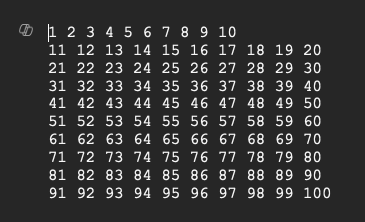
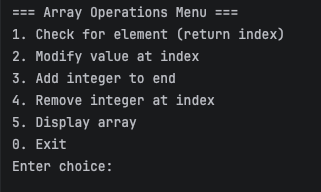
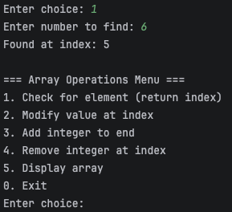
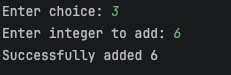
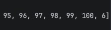
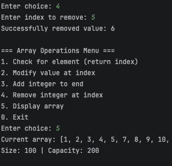

# Assignment 01: Array Operations & Exception Handling

## Problem Statement
Implement a Java program that implements operations on a standard array. Include proper exception handling.

## Requirements

### Functionality:
- Select 1: Check if integer exists, if present return index
- Select 2: Modify value of integer at index passed, return new value and modified value
- Select 3: Add new integer to end of array
- Select 4: Remove integer at an index

Array entered via 'input.txt' file:

Functionality 1 -- Check for element

Functionality 2 -- Modify element at index

Functionality 3 -- Add new element to end

Functionality 4 -- Remove element at index

